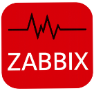

### Jardane Lima 

B.el. em Sistemas de Informação, com experiência em Help Desk e Redes de Telecomunicações. Atuação no monitoramento proativo de ambientes tecnológicos utilizando Zabbix,
Grafana e The Dude, além da configuração de ativos Mikrotik, visando estabilidade e alta disponibilidade operacional.

Minha trajetória integra competências técnicas e administrativas, com atuação em processos licitatórios, gestão de contratos e documentação técnica no contexto da administração
pública. 
Atualmente, direciono meu desenvolvimento para tecnologias emergentes, com foco no estudo e aplicação de Agentes de IA e automação inteligente de processos, buscando
soluções eficientes para ambientes dinâmicos e desafiadores.** 

#

###  Tools Monitoring and Automation

&nbsp;
&nbsp;
&nbsp;
&nbsp;

#

###  Hobbies 

  &nbsp;
  &nbsp;
  &nbsp;
  &nbsp;
  &nbsp;

  

#

###  Projetos Desenvolvidos 

#

<picture align="center">
  <source media="(prefers-color-scheme: dark)" srcset="https://raw.githubusercontent.com/mari4souza/mari4souza/output/github-contribution-grid-snake-dark.svg">
  <source media="(prefers-color-scheme: light)" srcset="https://raw.githubusercontent.com/mari4souza/mari4souza/output/github-contribution-grid-snake-dark.svg">
  
</picture>

